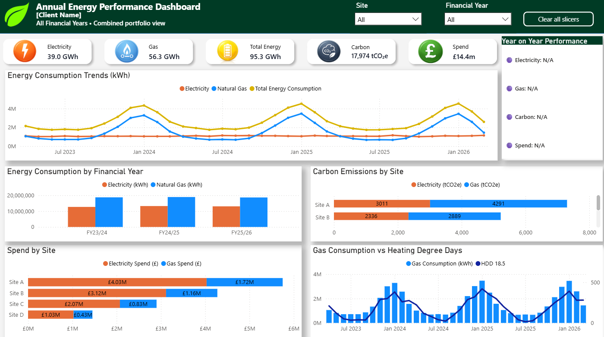
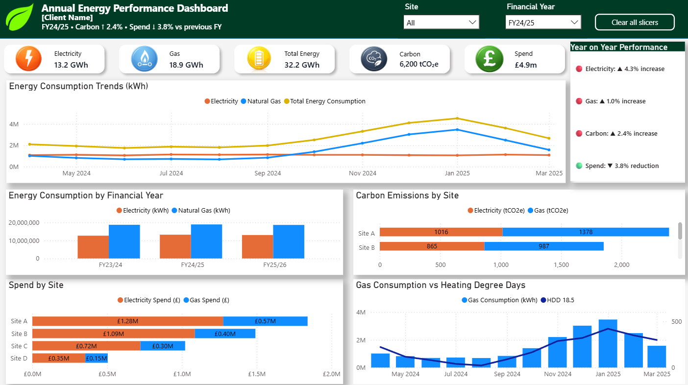
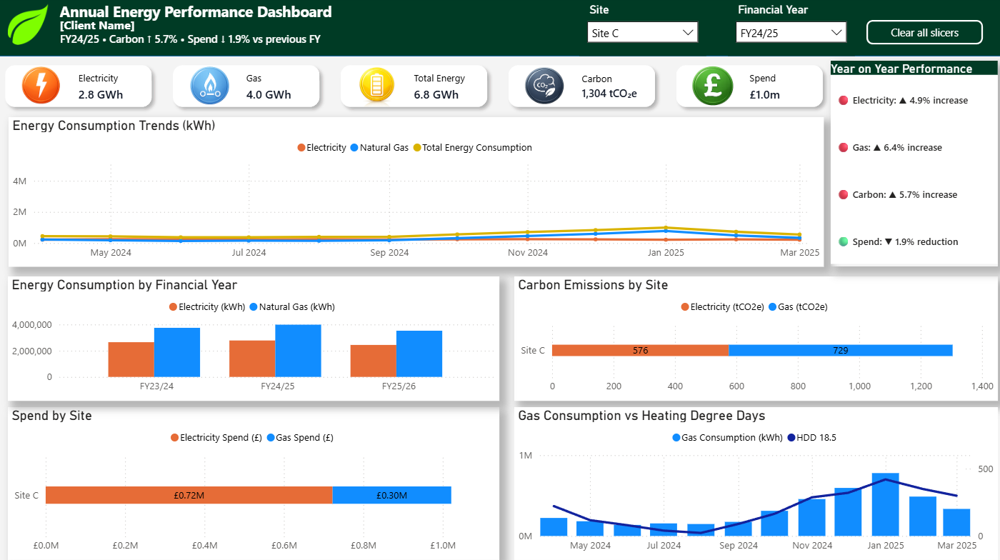

# Annual Energy Performance Dashboard

Power BI dashboard developed to monitor energy consumption, carbon emissions, and energy spend across a multi-site portfolio.

This project uses raw utility data, formatted reporting data, UK Government GHG Conversion Factors, and Heating Degree Day (HDD) data to create an executive-level energy performance dashboard.

---

## Dashboard Screenshots

### Portfolio Overview

Portfolio-wide view showing energy consumption, carbon emissions, spend, site performance and heating demand trends across all available financial years.

---

### Financial Year Analysis

Financial year-specific analysis demonstrating dynamic KPI calculations, year-on-year comparisons, and performance insights.

---

### Site-Level Analysis

Site-level drill-down showing energy consumption, carbon emissions, spend, and heating demand performance for an individual location.

---

## Project Objectives

- Track electricity and gas consumption across multiple sites
- Analyse total energy consumption trends
- Calculate carbon emissions using UK Government GHG Conversion Factors
- Monitor energy spend across a property portfolio
- Compare performance year-on-year
- Analyse gas consumption against Heating Degree Days (HDD)
- Present key insights through an executive reporting dashboard

---

## Data Sources

### Energy Data

- Monthly electricity consumption data
- Monthly gas consumption data
- Energy spend data
- Site-level reporting data

### Carbon Conversion Factors

Carbon emissions were calculated using official UK Government Greenhouse Gas Conversion Factors:

- 2023 GHG Conversion Factors
- 2024 GHG Conversion Factors
- 2025 GHG Conversion Factors

### Weather Data

- London City Airport Weather Station (ID:EGLC) Heating Degree Days (HDD 18.5°C)

---

## Data Preparation

The project involved transforming raw utility data into a structured reporting model suitable for dashboarding and analysis.

Key preparation steps included:

- Cleaning and validating raw energy data
- Standardising reporting formats
- Creating a consolidated reporting dataset
- Calculating electricity carbon emissions
- Calculating gas carbon emissions
- Creating total energy consumption measures
- Creating total carbon emission measures
- Creating spend measures
- Developing a custom Financial Year structure (April–March)
- Creating a dedicated Date Table for reporting and time intelligence calculations

---

## Data Model

The solution was built using a star-schema style model consisting of:

### Fact Tables

- Site Summary
- HDD (Heating Degree Day) Data

### Dimensions

- Date Table

Relationships were created to support:

- Financial Year reporting
- Site-level filtering
- Time intelligence calculations
- Dynamic KPI calculations
- Year-on-Year comparisons

---

## Power BI Features Used

- Power Query data transformation
- Data modelling and relationships
- Custom Date Table
- Financial Year logic
- DAX measures
- KPI cards
- Year-on-Year calculations
- Dynamic executive summary text
- Conditional formatting
- Interactive slicers
- Site-level filtering
- Carbon and spend analysis
- HDD analysis

---

## Dashboard Features

### Executive KPIs

High-level KPI cards provide visibility of:

- Electricity Consumption (GWh)
- Gas Consumption (GWh)
- Total Energy Consumption (GWh)
- Carbon Emissions (tCO₂e)
- Energy Spend (£)

### Dynamic Executive Summary

The dashboard generates dynamic narrative insights based on the selected Financial Year and Site filters.

Examples include:

- Carbon ↓ 7.7% vs previous FY
- Spend ↓ 7.9% vs previous FY

### Year-on-Year Performance

Dynamic indicators highlight whether:

- Electricity consumption increased or reduced
- Gas consumption increased or reduced
- Carbon emissions increased or reduced
- Energy spend increased or reduced

compared to the previous Financial Year.

### Energy Consumption Trends

Monthly electricity, gas, and total energy consumption trends are visualised to identify seasonality and consumption patterns.

### Carbon Emissions Analysis

Carbon emissions are broken down by fuel type and site to identify high-emitting locations.

### Spend Analysis

Energy spend is analysed by site and fuel type to support cost management.

### Heating Demand Analysis

Gas consumption is compared against Heating Degree Days (HDD) to investigate the relationship between weather conditions and heating demand.

---

## DAX Measures

Custom DAX measures were developed for:

- Electricity KPIs
- Gas KPIs
- Carbon KPIs
- Spend KPIs
- Total Energy KPIs
- Financial Year calculations
- Year-on-Year percentage changes
- Dynamic executive summary generation
- Dynamic insight indicators

---

## Skills Demonstrated

- Power BI Development
- Power Query
- DAX
- Data Modelling
- Time Intelligence
- Financial Year Reporting
- Sustainability Reporting
- Carbon Accounting
- Dashboard Design
- Data Visualisation
- Business Intelligence Reporting

---

## Tools Used

- Power BI Desktop
- Microsoft Excel
- Power Query
- DAX
- UK Government GHG Conversion Factors

---

## Notes

This project was developed as a portfolio project to demonstrate end-to-end Power BI development, from raw data preparation and carbon calculations through to executive dashboard reporting and interactive analytics.

The dashboard showcases practical applications of Power BI within energy management, sustainability reporting, and business intelligence environments.
